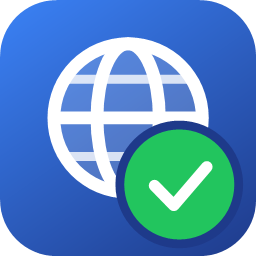
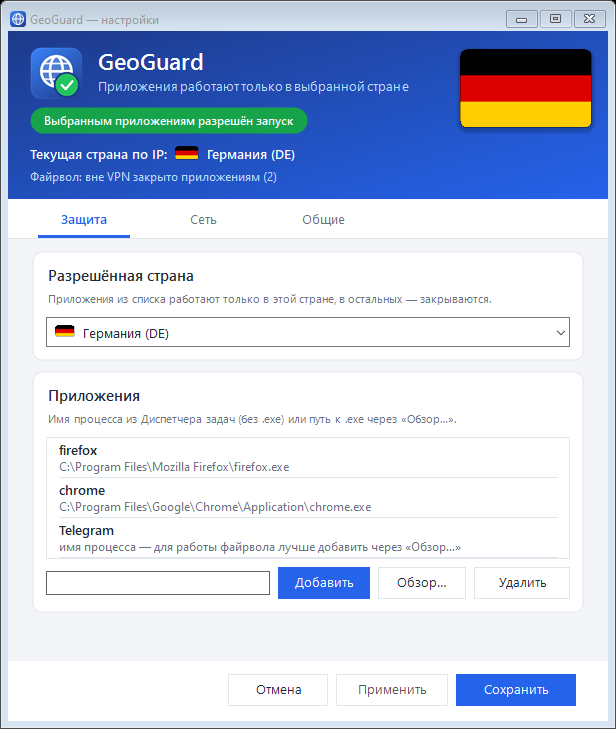
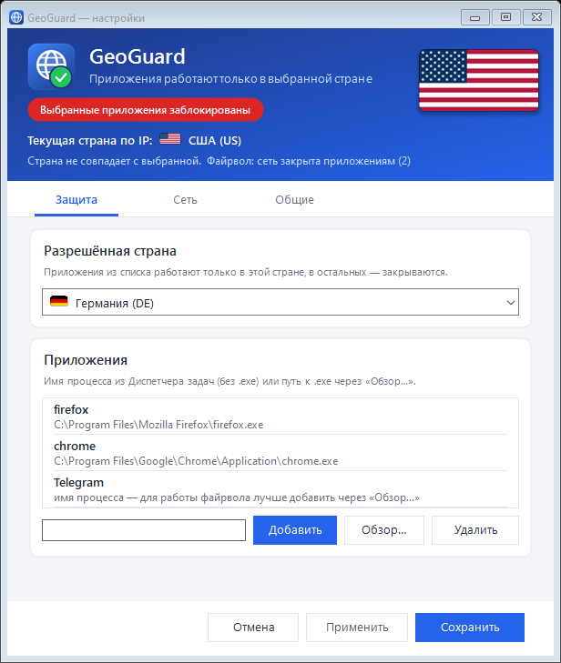
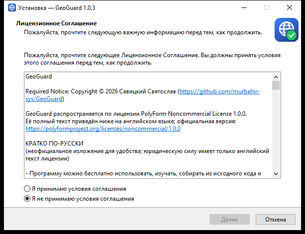
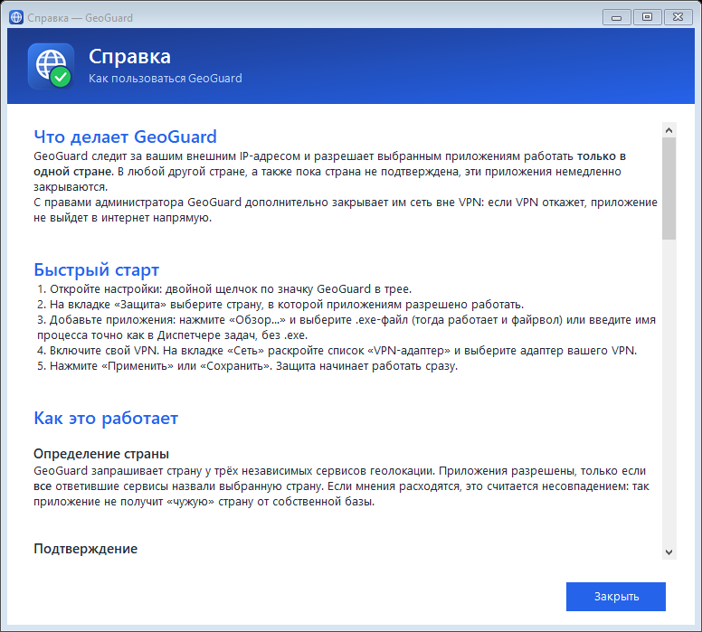

  

<h1 align="center">GeoGuard</h1>

  <b>Выбранные приложения работают только в одной стране — и только через VPN.</b>

  
  
  
  

  <a href="https://github.com/murbahir-sys/GeoGuard/releases/latest"><b>⬇ Скачать установщик</b></a>
  &nbsp;·&nbsp;
  <a href="#исходный-код-и-проверка"><b>Исходный код и проверка</b></a>

---

GeoGuard следит за вашим внешним IP-адресом и разрешает выбранным программам работать
**только в одной стране**. Если страна не совпадает с выбранной — например, VPN отключился или
переподключился в другую страну, — эти программы немедленно закрываются, а пока страна
не подтверждена, запустить их нельзя.

Это пригодится, когда сервис блокирует учётную запись за вход «не из той» страны
и важно, чтобы программа не увидела другую страну даже случайно.

  
  

## Возможности

- **Разрешённая страна.** Выбираете страну — программы из списка работают только в ней.
- **Любой VPN.** Подходит любой VPN, создающий в Windows сетевой адаптер: WireGuard, OpenVPN, AmneziaVPN,
  Proton VPN, встроенные VPN-подключения Windows и другие. Адаптер выбирается из списка, похожие на VPN помечены.
- **Мгновенная реакция на смену сети.** Включился, выключился или переподключился VPN, сменилась
  сеть — программы из списка закрываются сразу и снова разрешаются только после повторной проверки страны.
- **Надёжное определение страны.** Страна запрашивается у трёх независимых сервисов геолокации;
  программы разрешены, только если все ответившие сервисы назвали выбранную страну.
- **Сеть только через VPN.** С правами администратора GeoGuard создаёт правила Брандмауэра Windows:
  программам из списка закрыт выход в интернет мимо VPN-адаптера. Если VPN упадёт, программа
  не выйдет в сеть напрямую даже до того, как GeoGuard успеет её закрыть.
- **Не мешает разработке.** Запуск и остановка WSL, Docker и виртуальных машин ничего не закрывают:
  их внутренние сети не влияют на внешний IP.
- **Работает незаметно.** Живёт в трее, стартует вместе с Windows; цвет значка показывает состояние.
- **Бережёт VPN.** Известные VPN-клиенты защищены: GeoGuard никогда их не закрывает, даже если добавить их в список.

## Установка

1. Скачайте `GeoGuard-Setup-1.0.6.exe` со страницы [релизов](https://github.com/murbahir-sys/GeoGuard/releases/latest).
2. Запустите установщик и подтвердите запрос прав администратора.

   > Установщик не подписан цифровой подписью, поэтому Windows может показать окно
   > «Система Windows защитила ваш компьютер». Нажмите **«Подробнее» → «Выполнить в любом случае»**.
3. Примите лицензионное соглашение и оставьте флажок «Запускать GeoGuard вместе с Windows».
4. После установки откроется окно настроек.

Программа устанавливается вместе со средой .NET — ничего дополнительно ставить не нужно.

  

## Быстрый старт

1. Откройте настройки: двойной щелчок по значку GeoGuard в трее.
2. На вкладке **«Защита»** выберите разрешённую страну.
3. Добавьте программы. Надёжнее всего — кнопкой **«Обзор…»**, выбрав `.exe`-файл: тогда работает
   и закрытие, и файрвол. Можно ввести и имя процесса, но оно должно точно совпадать с именем
   в Диспетчере задач (например, у Total Commander x64 это `TOTALCMD64`, а не `TOTALCMD`).
4. Включите свой VPN. На вкладке **«Сеть»** раскройте список **«VPN-адаптер»** и выберите адаптер
   вашего VPN — похожие на VPN идут первыми и помечены, отключённые подписаны.
5. Нажмите **«Применить»** или **«Сохранить»** — защита начинает работать сразу.

## Какой VPN подходит

Любой, который создаёт в Windows сетевой адаптер, — так работают почти все VPN-клиенты:
WireGuard, OpenVPN, AmneziaVPN, Proton VPN, NordVPN, Mullvad, WireSock, корпоративные клиенты
и встроенные VPN-подключения Windows.

Выбранный адаптер нужен для двух вещей: только через него программам из списка разрешён выход в сеть,
и его отключение GeoGuard замечает мгновенно. Если адаптер не выбран, страна всё равно проверяется,
но файрвол не работает, а отключение VPN замечается только при очередной проверке страны —
об этом предупреждает надпись в окне настроек.

**Как понять, какой адаптер ваш:** включите VPN и раскройте список — адаптер VPN будет без пометки
«отключён»; выключите VPN — пометка появится. Можно ввести и часть имени или описания адаптера,
несколько вариантов — через «;».

Программы, работающие только как прокси, адаптера не создают: с ними GeoGuard проверяет страну,
но файрвол по адаптеру не работает. У многих таких программ есть режим TUN, который создаёт адаптер.

## Как это работает

| Состояние в окне | Что происходит |
|---|---|
| 🟢 **Выбранным приложениям разрешён запуск** | Страна подтверждена и совпадает с выбранной. Программы работают, выход в сеть — только через VPN. |
| 🔴 **Выбранные приложения заблокированы** | Страна не совпадает с выбранной. Программы закрываются, сеть им закрыта полностью. |
| 🟠 **Заблокированы: идёт проверка страны** | Сменилась сеть или сервисы геолокации не ответили. Программы закрыты до подтверждения страны. |
| 🔵 **Определяем страну…** | Первые секунды после запуска GeoGuard. Программы не трогаются, пока не придёт первый ответ. |

**При запуске** GeoGuard сначала определяет страну и только потом действует по настройкам:
совпала — всё работает, не совпала — программы закрываются. Если страну не удалось получить
два раза подряд (или ответа нет 30 секунд), программы закрываются.

**После запуска** действуют строгие правила: любая смена сети сразу закрывает программы,
а разрешение возвращается только после двух совпавших проверок подряд.

Подробная справка встроена в программу: меню значка в трее → **«Справка»** или клавиша **F1** в настройках.

  

## Требования

- Windows 10 или 11, 64-разрядная.
- Подключение к интернету (для определения страны).
- VPN, создающий сетевой адаптер, — для файрвола и мгновенной реакции на отключение VPN.
- Права администратора — для правил файрвола и автозапуска. Без них GeoGuard тоже работает,
  но только закрывает программы, без файрвола.

## Конфиденциальность

- Для определения страны GeoGuard обращается к сервисам **ipwho.is**, **api.country.is** и **get.geojs.io**.
  Эти сервисы видят ваш внешний IP-адрес. Никаких других данных программа не передаёт,
  телеметрии нет.
- Запросы бережные: к ipwho.is (бесплатно — 1000 запросов в сутки) — не чаще раза в 2 минуты,
  а сервис, попросивший подождать, программа не беспокоит 15 минут.
- Настройки хранятся только на вашем компьютере: `%AppData%\GeoGuard\settings.json`.

## Удаление

«Параметры Windows» → «Приложения» → **GeoGuard** → «Удалить». Вместе с программой удаляются
правила файрвола и автозапуск; настройки удаляются по вашему выбору.

Если нужно временно отключить защиту — меню значка в трее → **«Выход»**.

## Вопросы и ответы

**Почему закрылась моя программа?**
Либо страна не совпала с выбранной, либо сменилась сеть (например, переподключился VPN) и страна
ещё не подтверждена. Когда в окне снова зелёная плашка, программу можно запустить. Закрытые
программы сами не перезапускаются.

**Программа из списка не закрывается, хотя страна другая.**
Скорее всего, имя процесса указано неточно. Удалите запись и добавьте программу через «Обзор…».

**Страна верная, но программа не выходит в интернет.**
При включённом файрволе программе разрешена сеть только через VPN-адаптер. Проверьте, что VPN
включён и на вкладке «Сеть» выбран именно его адаптер. Если VPN не используется,
снимите галочку файрвола.

**Можно ли добавить в список сам VPN-клиент?**
Нет. Известные VPN-клиенты (AmneziaVPN, WireGuard, OpenVPN, Proton VPN, NordVPN, Mullvad и другие)
защищены: GeoGuard не закроет их и не создаст для них правил, чтобы не отключить сам VPN.

**Как удалить правила файрвола, если программа не запускается?**
Выполните `GeoGuard.exe --remove-rules` из папки программы (потребуется подтверждение администратора)
или удалите GeoGuard через «Приложения».

**Это не вирус?**
Нет. Исходный код полностью открыт — см. раздел [«Исходный код и проверка»](#исходный-код-и-проверка).
Windows SmartScreen и некоторые антивирусы настороженно относятся к новым программам без цифровой подписи,
особенно если они работают с правами администратора и меняют правила брандмауэра, — это предупреждение
о неизвестном издателе, а не о найденной угрозе.

## Исходный код и проверка

Исходный код GeoGuard полностью открыт в этом репозитории — любой может проверить, что делает программа.

| Где | Что там |
|---|---|
| [`GeoGuard/`](GeoGuard) | программа: окна, значок в трее, логика (C#, .NET 10, Windows Forms) |
| [`GeoGuard/GeoLocationService.cs`](GeoGuard/GeoLocationService.cs) | все сетевые запросы программы — только к трём сервисам геолокации |
| [`GeoGuard/GuardEngine.cs`](GeoGuard/GuardEngine.cs) | проверка страны, реакция на смену сети, закрытие программ из списка |
| [`GeoGuard/WindowsFirewall.cs`](GeoGuard/WindowsFirewall.cs), [`FirewallPlanner.cs`](GeoGuard/FirewallPlanner.cs) | правила Брандмауэра Windows |
| [`GeoGuard/AutoStart.cs`](GeoGuard/AutoStart.cs) | автозапуск через Планировщик заданий |
| [`GeoGuard.Tests/`](GeoGuard.Tests) | автоматические тесты |
| [`installer/`](installer) | сценарий установщика Inno Setup |
| [`build/build.ps1`](build/build.ps1) | сборка программы и установщика одной командой |

**Что программа делает и чего не делает:**

- обращается в интернет только к **ipwho.is**, **api.country.is** и **get.geojs.io** — чтобы узнать страну;
- закрывает только программы из вашего списка; известные VPN-клиенты не трогает никогда;
- с правами администратора создаёт правила брандмауэра с именами «GeoGuard: …» и задачу «GeoGuard»
  в Планировщике заданий — и удаляет их при удалении программы;
- не собирает и не отправляет никаких данных, ничего не скачивает и не запускает сторонних файлов.

**Как проверить установщик:**

- сравните контрольную сумму скачанного файла с указанной в описании релиза:
  `Get-FileHash .\GeoGuard-Setup-1.0.6.exe` в PowerShell;
- или соберите программу сами:
  1. Установите .NET SDK 10 и Inno Setup 6:
     `winget install Microsoft.DotNet.SDK.10` и `winget install JRSoftware.InnoSetup`.
  2. Скачайте исходники: кнопка **Code → Download ZIP** или `git clone`.
  3. В папке с исходниками выполните `powershell -ExecutionPolicy Bypass -File build\build.ps1 -RunTests`.

  Готовый установщик появится в `dist\installer`. Его контрольная сумма будет отличаться от официальной —
  сборка не побитово воспроизводимая, это нормально. Технические подробности — в [GeoGuard/README.md](GeoGuard/README.md).

## Лицензия

GeoGuard — свободная программа с открытым исходным кодом под лицензией **MIT**.

Программу можно бесплатно использовать для любых целей, в том числе коммерческих, изучать, изменять,
распространять и продавать, в том числе в составе других программ. Единственное условие — сохранять
уведомление об авторских правах и текст лицензии во всех копиях и существенных частях программы.
Программа предоставляется «как есть», без гарантий. Полный текст — в [LICENSE.txt](LICENSE.txt).

> **Просьба автора.** Если вы используете GeoGuard или его код в своём проекте, пожалуйста, укажите
> автора — **Савицкий Святослав** — и ссылку на https://github.com/murbahir-sys/GeoGuard в титрах,
> окне «О программе» или разделе благодарностей. Это не обязательное условие лицензии, а просьба —
> но автору будет приятно.

Сторонние компоненты — среда выполнения .NET (© .NET Foundation, MIT), изображения флагов
[flagpedia.net](https://flagpedia.net), установщик [Inno Setup](https://jrsoftware.org/isinfo.php) —
перечислены в [THIRD-PARTY-NOTICES.txt](THIRD-PARTY-NOTICES.txt).

---

© 2026 Савицкий Святослав

